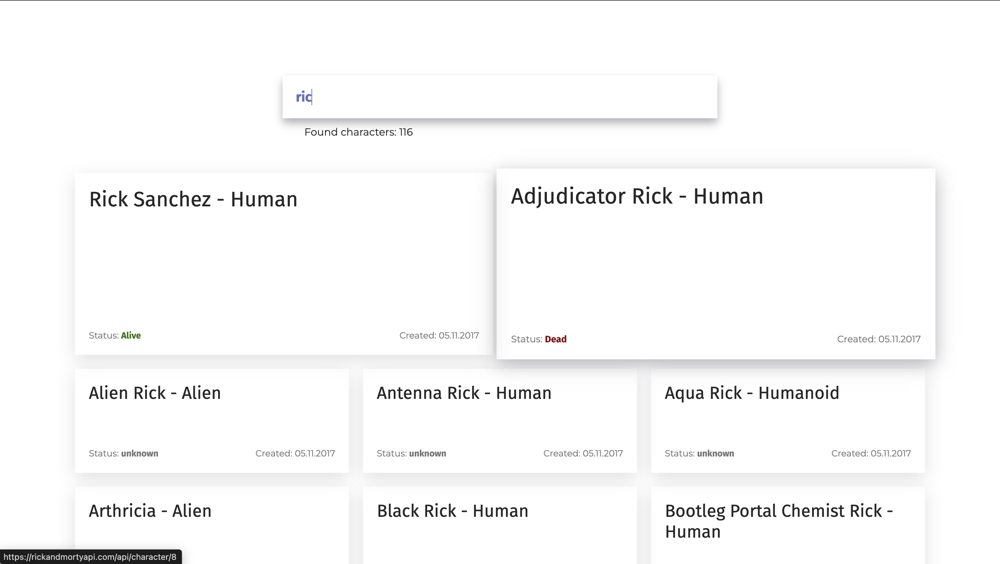

# Тестовое задание Fuse8

Стек: React, TypeScript, SCSS Modules, Axios, Vite

В соответствии с ТЗ выполнены следующие задачи:

-   реализованы запросы к апи
-   реализована логика поиска персонажа
-   реализована динамиеческая пагинация
-   добавлена индикация загрузки данных
-   реализованы необходимые компоненты в соответствии с макетом

## Структура проекта

-   src/ — исходные файлы проекта
-   src/components/ — React компоненты
-   src/pages - страницы приложения
-   src/styles/ - глобальные стили и переменные
-   src/ui-kit - переиспользуемые ui компоненты
-   src/utils/api - интеграция с апи
-   src/utils/constants - глобальные константы
-   App.tsx - основной компонент приложения

## Примечания

1. Поскольку приложение небольшое, было решено не использовать стейт менеджер и ограничиться хранением данных в локальных стейтах.
2. Первый запрос на бэк отправляется автоматически после введения 3 символов пользователем. Следующие запросы также отправляются автоматически, но было принято решение выжидать небольшую паузу перед отправкой следующего запроса: если в эту паузу пользователь продолжает вводить запрос, то ждем, если прекращает - отправляем на бэк. Таким образом, нам не приходится слать запросы на каждый ввденный символ.
3. Добавила парочку френдли решений по ui :)

-   Инпут в фокусе подсвечивается
-   при ховере карточка увеличивается и подсвечивается
-   появляется прелоадер на время подгрузки персонажей

4. В задании про это не было, но также добавила бесконечный скролл, чтобы пользователь мог увидеть все карточки, которые существуют

## Страница поиска



## Установка и запуск

1. Создайте в корне проекта файл `.env` с содержимым файла `.env.example`
2. Установите зависимости и запустите проект:

```
npm install
npm run dev
```
